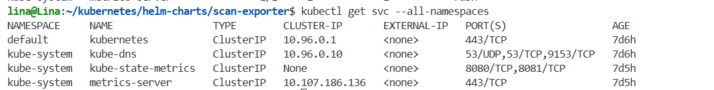
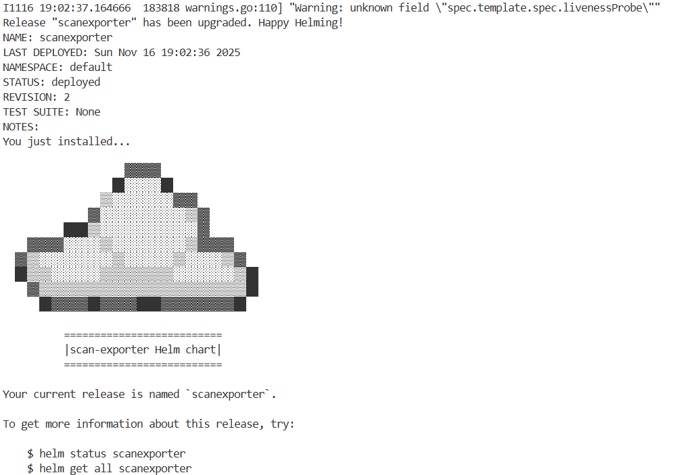
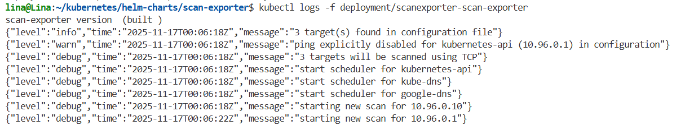
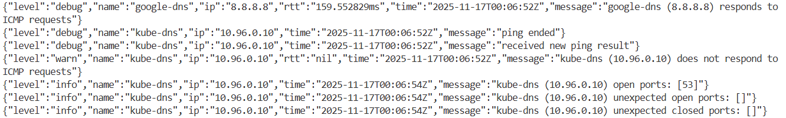
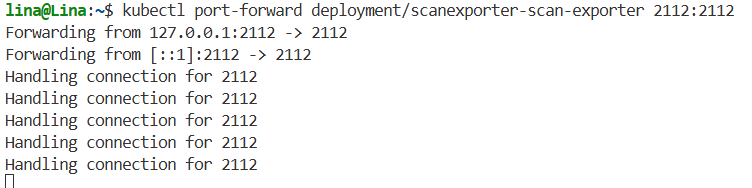
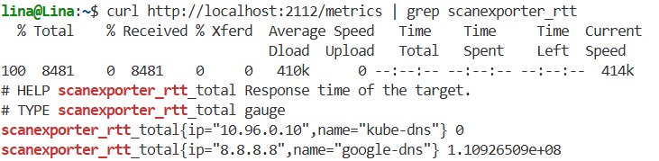
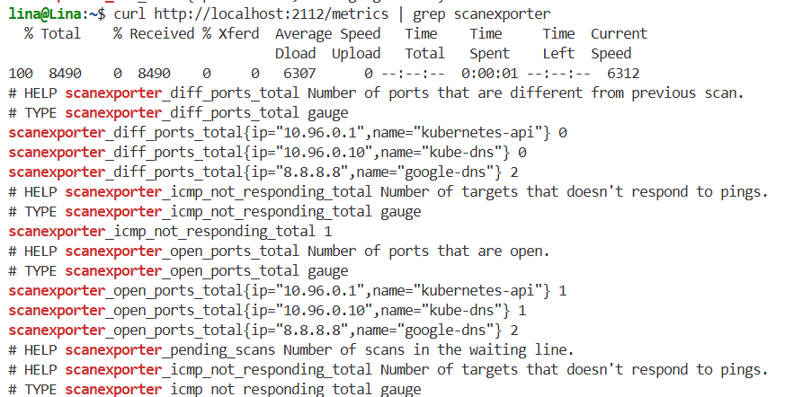

# Devops.Works helm charts

This repository hosts [Devops.Works](http://devops.works/) helm charts.

## Authors

[@devops-works](https://github.com/devops-works)

# Development of the guide 

To follow this guide, you must have:

- A working Kubernetes cluster (Minikube, k3s, or any other)
- kubectl installed and configured
- helm installed (version 3.x or higher)
- Access to the repository: https://github.com/devops-works/helm-charts

## Helm

Furthermore, it is important to note that:

- Helm is the package manager for Kubernetes. 
- Chart is a helm package containing all the resources needed to deploy an application.
- Release is an installed instance of a Chart in the cluster.
- Values is the configuration file that customizes the behavior of the Chart.
- Templates are a set of YAML files with variables that are rendered with the values.

## Development

**Step 1:** 

Clone the repository

```bash
git clone https://github.com/devops-works/helm-charts.git
```
Navigate to the scan-exporter directory

```bash
cd helm-charts/charts/scan-exporter
```
Verify the structure

```bash
ls -la
```
**Step 2:** 
Obtain the IPs of the actual services

Remember that scan-exporter requires IPs, not DNS names. So, you need obtain the ips of your services:

```bash
kubectl get svc -A
```

Example output:



**Step 3:** 
Create your custom values file.

Create a `my-values.yaml` file or edit the existing `values.yaml` file with your own configuration.

In this case, I replaced this section:

```bash
targets: |-
        timeout: 2
        limit: 1024
        targets:
            - name: "kubernetes-api"
              ip: "10.96.0.1"  #Change this value with the IP you obtained in Step 2
              tcp:
                period: "30s"
                range: "reserved"
                expected: "443"
              icmp:
                period: "30s"
            
            - name: "kube-dns"
              ip: "10.96.0.10"  #Change this value with the IP you obtained in Step 2
              tcp:
                period: "30s"
                range: "reserved"
                expected: "53"
              icmp:
                period: "30s"
            
            - name: "google-dns"
              ip: "8.8.8.8"
              tcp:
                period: "1m"
                range: "reserved"
                expected: "53"
              icmp:
                period: "30s"
```

**Step 4:** 
Validate the configuration. Before installing, validate that everything is correct:

```bash
helm template scanexporter . -f my-values.yaml --debug 2>&1 | head -100
```

Check for syntax errors

```bash
helm lint . -f my-values.yaml
```
**Step 5:** Install the Chart

Install scan-exporter

```bash
helm install scanexporter . -f my-values.yaml
```

Expected output:



**Step 6:** Verify installation

View release status

```bash
helm status scanexporter
```

View the resources created

```bash
kubectl get all
```
View specifically the deployment and pods

```bash
kubectl get deployment scanexporter-scan-exporter
kubectl get pods -l app=scanexporter-scan-exporter
```
```bash
kubectl logs -f deployment/scanexporter-scan-exporter
```

Expected logs:





**Step 8:** Verify metrics

Expose the metrics port locally:

In a terminal:

```bash
kubectl port-forward deployment/scanexporter-scan-exporter 2112:2112
```


In another terminal, check the metrics:

```bash
curl http://localhost:2112/metrics
```

Example metrics:





## Updating the configuration

If you need to change the configuration:

**Option 1:** Update with helm upgrade. Edit `my-values.yaml` with your changes

```bash
nano my-values.yaml
```

Apply the changes

```bash
helm upgrade scanexporter . -f my-values.yaml
```
Verify the update

```bash
helm history scanexporter
```
**Option 2:** Force pod restart. If you only change the ConfigMap, delete the ConfigMap

```bash
kubectl delete configmap scan-exporter-config
```
Update with Helm

```bash
helm upgrade scanexporter . -f my-values.yaml
```
Restart the deployment and verify the status

```bash
kubectl rollout restart deployment/scanexporter-scan-exporter
kubectl rollout status deployment/scanexporter-scan-exporter
```

## Troubleshooting

Problem 1: “Cannot parse IP” error
Symptom: json{“level”:“error”,‘message’:“cannot parse IP kubernetes.default.svc.cluster.local”}
Solution: Scan-exporter requires IPs, not DNS names. Use kubectl get svc -A to obtain the actual IPs.

Problem 2: “PodMonitor not found” error
Symptom:
Error: no matches for kind “PodMonitor” in version “monitoring.coreos.com/v1”
Solution:
You do not have Prometheus Operator installed. Disable PodMonitor in my-values.yaml:
```bash
podMonitor:
  enabled: false
```
Problem 3: ICMP does not respond (ClusterIP services)
Symptom:
json{“level”:“warn”,‘message’:“kube-dns (10.96.0.10) does not respond to ICMP requests”}
Solution:
This is normal. ClusterIP services are virtual IPs that do not respond to ping. They only respond to TCP connections. You can ignore the warning or remove the icmp section from the internal targets


Problem 4: The pod is not updating
Symptom:
The logs continue to show the old configuration.
Solution: 

Force pod restart
```bash
kubectl delete pod -l app=scanexporter-scan-exporter
```
Or use rollout restart

```bash
kubectl rollout restart deployment/scanexporter-scan-exporter
```